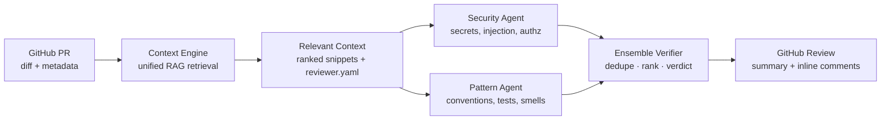
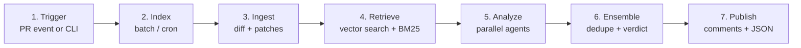
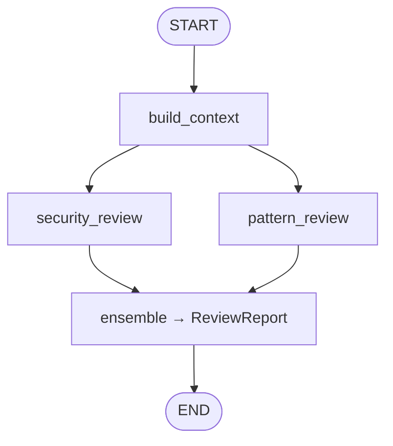
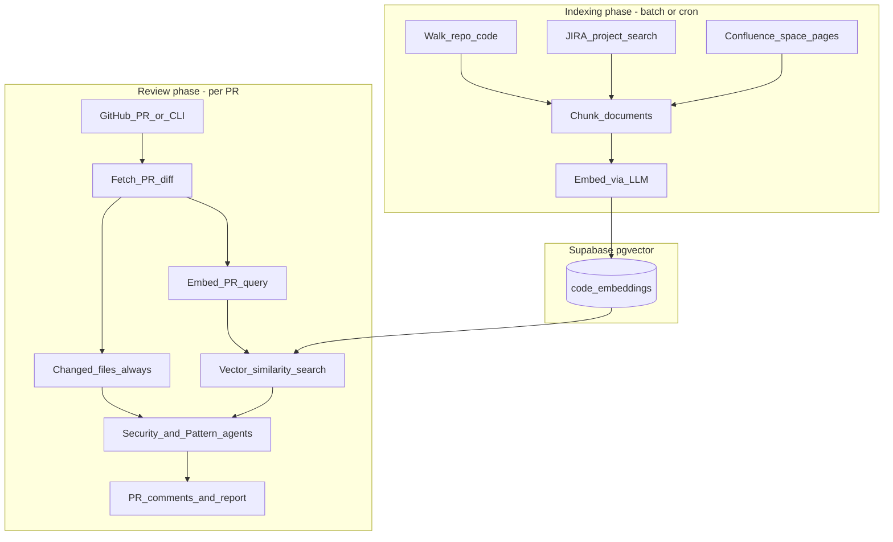
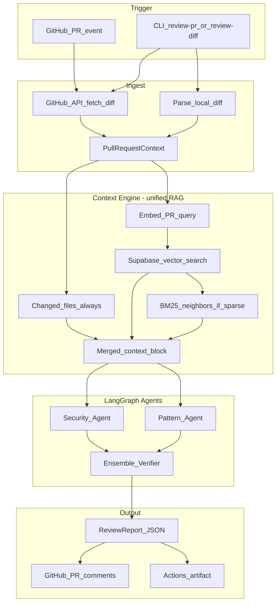
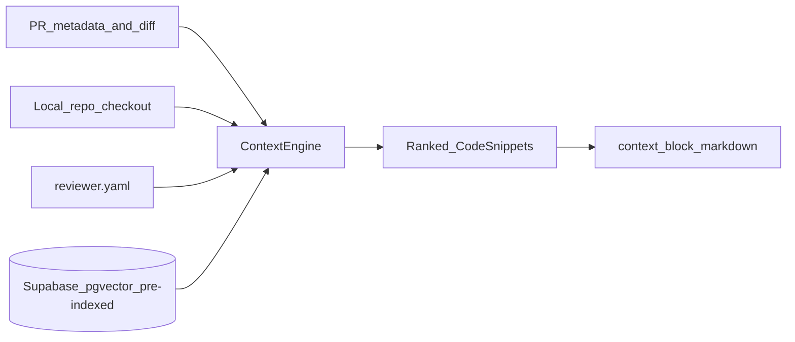
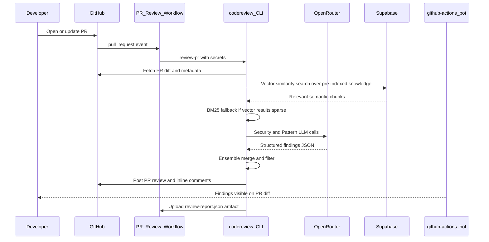

# Multi-Agent GitHub PR Reviewer

Production-style PR review pipeline for GitHub: batch-index knowledge into Supabase, retrieve relevant context at review time, run parallel security and pattern agents, ensemble the findings, and post structured review comments.

**v0.4.0** — unified RAG (code + JIRA + Confluence), semantic dedupe, optional LLM ensemble verifier, and offline demo.



## How it works (summary)



1. **Trigger** — PR opened/updated or `codereview review-pr` from CLI
2. **Index** (batch/cron) — `codereview index-knowledge` embeds repo code + JIRA + Confluence into Supabase
3. **Ingest** — fetch changed files and unified diff from GitHub
4. **Retrieve** — changed files + unified vector search over pre-indexed knowledge (`unified_rag: true`)
5. **Analyze** — Security + Pattern agents run in parallel (LangGraph)
6. **Ensemble** — dedupe, filter by confidence/severity, assign verdict
7. **Publish** — structured PR review + inline comments + `review-report.json`



---

## Data flow (detailed)



### Index knowledge (run before reviews)

```bash
# One-time or scheduled (see .github/workflows/knowledge-index.yml)
codereview index-knowledge --repo owner/repo --repo-root . --config reviewer.yaml
```

Requires `vector.enabled: true`, Supabase credentials, and `LLM_API_KEY`. When `external_context.enabled: true`, JIRA projects and Confluence spaces are indexed alongside repo code.

### End-to-end pipeline (review time)



### Step 1 — Trigger

| Path | When |
|---|---|
| **GitHub Action** | `pull_request` opened, synchronized, or reopened |
| **CLI** | `codereview review-pr owner/repo#123` or `codereview review-diff file.patch` |

### Step 2 — Ingest → `PullRequestContext`

The pipeline normalizes all inputs into one object:

| Field | Purpose |
|---|---|
| `changed_files[]` | Files touched in the PR |
| `patches{}` | Unified diff hunks per file |
| `title`, `body` | PR metadata for query terms and JIRA key extraction |
| `head_ref`, `base_ref` | Branch names (ticket keys often appear here) |
| `head_sha` | Commit identity for idempotent GitHub review posting |

### Step 3 — Hybrid context engine

When `vector.unified_rag: true` (default), review-time retrieval is:

1. **Changed files** — always included directly
2. **Unified vector search** — semantic search over pre-indexed code, JIRA, and Confluence chunks in Supabase
3. **BM25 fallback** — if vector search returns fewer than `context.min_vector_snippets_before_fallback` hits, neighbor files are added via keyword scoring

Live JIRA/Confluence API calls are **not** made during review. Run `codereview index-knowledge` (or the `knowledge-index.yml` workflow) to refresh the index.

Set `vector.unified_rag: false` to restore the legacy path: BM25 neighbors always on + optional `index_on_review` embedding + live JIRA/Confluence fetch.

`ContextEngine.build_context()` merges sources, ranks by score, and returns the top N snippets (`context.max_snippets`, default 12).



#### A. Changed files (always on)

Every file in the PR diff is included with a high fixed score. This guarantees the agents always see what actually changed.

#### B. Unified vector search (recommended)

When `vector.enabled: true`, `vector.unified_rag: true`, and Supabase credentials are set:

1. The PR title, body, and diff are embedded into a query vector
2. `match_code_embeddings()` searches pre-indexed chunks (code, JIRA, Confluence) keyed by `owner/repo`
3. Top-K similar chunks are merged into context with reason `vector_match:<source>`

Indexing happens separately via `codereview index-knowledge` or the scheduled `knowledge-index.yml` workflow — not on every PR review.

**Fail-open:** if Supabase or embeddings fail, the review continues with changed files + BM25 fallback.

#### C. BM25-lite neighbors (fallback / legacy)

- Used when unified vector search returns too few snippets, or when `unified_rag: false`
- Loads sibling files in the same directory as changed files
- Scores neighbors by keyword overlap with PR title, body, and diff tokens
- Zero external infrastructure; works offline

#### D. Legacy: index-on-review + live Atlassian (opt-in)

Set `vector.unified_rag: false` to enable the v0.3 path:

- **`index_on_review: true`** — embed and upsert changed/neighbor files during each review (builds semantic memory incrementally)
- **Live JIRA/Confluence** — when `external_context.enabled: true`, fetches ticket/page content at review time

With the default unified RAG config, steps D is skipped entirely.

### Step 4 — LangGraph agent orchestration

```text
START → build_context
           ├→ security_review  ─┐
           └→ pattern_review   ─┴→ ensemble → ReviewReport → END
```

Both specialist agents receive the same inputs:

- PR diffs (`PullRequestContext.patches`)
- `context_block` (merged snippets from step 3)
- `reviewer.yaml` (team rules, severity thresholds, custom regex rules)
- Optional LLM client (OpenRouter / OpenAI / Anthropic)

| Agent | Focus | Layers |
|---|---|---|
| **Security** | Secrets, injection, authz, unsafe defaults | Heuristics always; LLM if `LLM_API_KEY` set |
| **Pattern** | Conventions, TODOs, tests, docs, smells | Heuristics always; LLM if `LLM_API_KEY` set |
| **Ensemble** | Semantic dedupe, optional LLM verify, filter, verdict | Rules-based dedupe; optional `ensemble.llm_verify` |

**LLM fail-open:** if any LLM call fails, heuristic findings are still returned. The report includes `llm_degraded: true` when ensemble verification falls back.

### Step 5 — Structured output

Each finding is a typed object (not free-form prose):

| Field | Example |
|---|---|
| `category` | `security` |
| `severity` | `high` |
| `title` | `Possible hardcoded secret` |
| `file` / `line` | `src/app/auth.ts:42` |
| `rationale` | Why this matters |
| `suggestion` | What to do instead |
| `confidence` | `0.85` |
| `agent` | `security` |

**Ensemble verdict:**

| Verdict | When |
|---|---|
| `request_changes` | Any high or critical finding survives filtering |
| `comment` | Medium/low findings only |
| `approve` | No findings above threshold |

**Outputs:**

- GitHub PR review (summary + inline comments on changed lines)
- `review-report.json` (audit artifact with latency, token usage, estimated cost)
- GitHub Actions artifact (`review-report`)

### GitHub Action sequence



### What is always on vs optional

| Component | Default | If unavailable |
|---|---|---|
| Changed files | Always | N/A |
| Unified vector search | On when `vector.enabled: true` | Falls back to BM25 |
| BM25 neighbors | Fallback when vectors sparse, or legacy mode | N/A |
| LLM agents | On when `LLM_API_KEY` set | Heuristics only |
| JIRA / Confluence (indexing) | Off | Skipped at index time |
| JIRA / Confluence (live fetch) | Off (`unified_rag: true`) | Skipped at review time |
| GitHub posting | On in Action (`dry_run: false`) | Report still generated locally |

### Core object flow

```text
PullRequestContext
  → ContextEngine → list[CodeSnippet] → context_block (markdown)
  → SecurityAgent  → list[Finding]
  → PatternAgent   → list[Finding]
  → EnsembleAgent  → ReviewReport
  → GitHubClient   → PR review + inline comments
```

---

## Example output on GitHub

```text
github-actions[bot] requested changes · reviewed just now

Automated multi-agent review found 8 issue(s): 2 critical, 2 high, 4 medium
Overall confidence: 0.87 · Latency: 6076 ms

1. [CRITICAL / security] Hardcoded API Key — src/app/auth.ts:42
2. [HIGH / security] SQL Injection Risk — src/db/query.py:18

Inline on diff:
  + const api_key = "sk-live-secret";
  > [critical] Hardcoded API Key
  > Use environment variables or a secret manager.
```

See [`docs/images/github-review-example.svg`](docs/images/github-review-example.svg) for a visual mock.

## Features

- **Unified RAG** — batch-index code + JIRA + Confluence into Supabase; query vectors at review time
- Structured findings: category, severity, file, line, rationale, suggestion, confidence
- Hybrid context retrieval: changed files + vector search + BM25 fallback
- **Offline demo** — `codereview demo` with mock JIRA/Confluence and in-memory vectors (no APIs)
- Semantic finding dedupe (merges similar titles without collapsing distinct adjacent issues)
- Accurate line numbers from diff hunks
- Optional **JIRA / Confluence** indexing (fail-open, disabled by default)
- Benchmark eval suite with CI gate (4 golden cases; recall ≥ 0.9, precision ≥ 0.65)
- Parallel specialist agents with LangGraph fan-out/fan-in
- Ensemble verifier with optional LLM cross-check (`ensemble.llm_verify`)
- Works offline with `review-diff` (no GitHub API)
- GitHub Action for company repos
- Team rules via `reviewer.yaml` (procedural memory)
- OpenRouter, OpenAI, or Anthropic for LLM-backed analysis

## Quick start

### 1. Install

```bash
python -m venv .venv
source .venv/bin/activate
pip install -e ".[dev]"
```

### 2. Configure

Copy the example config into your target repo:

```bash
cp reviewer.example.yaml reviewer.yaml
```

Set environment variables:

```bash
export LLM_API_KEY=sk-or-...          # OpenRouter API key
export LLM_PROVIDER=openrouter        # openrouter | openai | anthropic
export LLM_MODEL=openai/gpt-4o-mini   # optional; any OpenRouter model slug
export GITHUB_TOKEN=ghp_...           # only needed for review-pr
```

Copy [`.env.example`](.env.example) to `.env` for local development.

**OpenRouter (recommended):** use your OpenRouter key as `LLM_API_KEY` with `LLM_PROVIDER=openrouter`. Pick any model from [openrouter.ai/models](https://openrouter.ai/models), e.g. `openai/gpt-4o-mini`, `anthropic/claude-3.5-sonnet`.

### 3. Run the offline demo (no API keys)

```bash
codereview demo
```

This indexes mock JIRA/Confluence fixtures + a golden-case repo into an in-memory vector store, runs the full review pipeline, and writes `demo-report.json`.

### 4. Review a local diff (heuristics only, no API keys)

```bash
codereview review-diff tests/fixtures/sample_diff.patch --repo-root .
```

### 5. Index knowledge into Supabase (unified RAG)

```bash
export SUPABASE_URL=https://your-project-ref.supabase.co
export SUPABASE_SERVICE_ROLE_KEY=eyJ...
export LLM_API_KEY=sk-or-...

codereview index-knowledge --repo owner/repo --repo-root . --config reviewer.yaml
```

Enable vectors in `reviewer.yaml` (`vector.enabled: true`). See [Unified RAG setup](#unified-rag-setup) below.

### 6. Review a GitHub PR

```bash
codereview review-pr owner/repo#123 --repo-root . --output review-report.json
```

Use `--dry-run` to generate the report without posting comments.

## Unified RAG setup

The recommended path: **batch-index all knowledge sources**, then **query vectors at review time**.

1. Create a [Supabase](https://supabase.com) project (or use the CLI: `supabase projects create`)
2. Link and push migrations:

```bash
supabase link --project-ref <your-project-ref>
supabase db push
```

Or run both migrations manually in the SQL editor:

- [`supabase/migrations/001_code_embeddings.sql`](supabase/migrations/001_code_embeddings.sql) — table + RPC
- [`supabase/migrations/002_unified_knowledge_source.sql`](supabase/migrations/002_unified_knowledge_source.sql) — `source` column (code / jira / confluence)

3. Set secrets / env vars:

```bash
export SUPABASE_URL=https://your-project-ref.supabase.co
export SUPABASE_SERVICE_ROLE_KEY=eyJ...
export LLM_API_KEY=sk-or-...
```

4. Enable in `reviewer.yaml`:

```yaml
vector:
  enabled: true
  unified_rag: true
  embedding_model: openai/text-embedding-3-small
  indexing:
    sources: [code, jira, confluence]
  supabase:
    enabled: true
    index_on_review: false   # batch index via index-knowledge
    match_threshold: 0.55
    vector_top_k: 12
```

5. Index knowledge (one-time or on a schedule):

```bash
codereview index-knowledge --repo owner/repo --repo-root .
```

The [`knowledge-index.yml`](.github/workflows/knowledge-index.yml) workflow runs this on push to `main` and daily at 06:00 UTC when repo secrets are configured.

If Supabase is unavailable, the agent **falls back to changed files + BM25** automatically.

### Supabase schema

| Object | Role |
|---|---|
| `code_embeddings` table | Chunked content + 1536-dim vectors per `owner/repo`, tagged by `source` |
| `match_code_embeddings()` | RPC for cosine-similarity search filtered by repo |

## Legacy: BM25 + index-on-review

By default, context retrieval uses **BM25-lite** over changed files and neighbors when vectors are disabled (zero infra).

To use the v0.3 incremental indexing path instead of unified RAG:

```yaml
vector:
  enabled: true
  unified_rag: false
  supabase:
    index_on_review: true
```

On each review, changed files are embedded and stored; similar chunks are retrieved for the PR query. Over time this builds a **per-repo semantic memory** in Supabase.

## JIRA / Confluence indexing (opt-in, fail-open)

With unified RAG, JIRA and Confluence are **indexed in batch** (not fetched live at review time).

```yaml
external_context:
  enabled: true
  jira:
    enabled: true
    base_url: yourcompany.atlassian.net
    projects: [CP]
  confluence:
    enabled: true
```

PR convention:

```markdown
## JIRA
[CP-123] Add session export

## Confluence
https://yourcompany.atlassian.net/wiki/spaces/ENG/pages/123456/Design
```

Secrets (GitHub Actions or local):

```bash
export ATLASSIAN_EMAIL=you@company.com
export ATLASSIAN_API_TOKEN=...
export ATLASSIAN_DOMAIN=yourcompany.atlassian.net
```

If credentials are missing or Atlassian is down, indexing **skips those sources** and continues with repo code.

For live fetch at review time (legacy), set `vector.unified_rag: false` and `external_context.enabled: true`.

## Benchmark evaluation

Measure precision/recall on labeled golden diffs:

```bash
codereview eval --benchmark-dir benchmarks/golden --output benchmarks/results.json
```

Use this to tune `severity_threshold`, compare OpenRouter models, and catch regressions when changing prompts or agents. CI enforces recall ≥ 0.9 and precision ≥ 0.65 on 4 golden cases. See [`benchmarks/README.md`](benchmarks/README.md) to add more cases (target 20+ real PRs over time).

## GitHub Action (company install)

Add to your company repo:

```yaml
# .github/workflows/pr-review.yml
name: PR Review
on:
  pull_request:
    types: [opened, synchronize, reopened]

permissions:
  contents: read
  pull-requests: write

jobs:
  review:
    runs-on: ubuntu-latest
    steps:
      - uses: actions/checkout@v4
        with:
          fetch-depth: 0

      - uses: cipheraxat/codereviewer_agent/action@main
        with:
          llm_api_key: ${{ secrets.LLM_API_KEY }}
          llm_provider: openrouter
          llm_model: openai/gpt-4o-mini
          config_path: reviewer.yaml
          dry_run: "false"
```

The action reads these **optional** repository secrets when present:

| Secret | Purpose |
|---|---|
| `LLM_API_KEY` | OpenRouter/OpenAI/Anthropic (review + embeddings) |
| `SUPABASE_URL` | Supabase project URL for vector context |
| `SUPABASE_SERVICE_ROLE_KEY` | Supabase service role for embedding upsert/search |
| `ATLASSIAN_EMAIL` | JIRA/Confluence API user (optional) |
| `ATLASSIAN_API_TOKEN` | Atlassian API token (optional) |
| `ATLASSIAN_DOMAIN` | e.g. `yourcompany.atlassian.net` (optional) |

Reviews post as **github-actions[bot]** using the default `GITHUB_TOKEN`.

### Company setup checklist

1. Add `reviewer.yaml` with your team's ignore paths and custom rules
2. Create repo secrets: `LLM_API_KEY`, `SUPABASE_URL`, `SUPABASE_SERVICE_ROLE_KEY`
3. Push Supabase migrations (`001` + `002`) and run `codereview index-knowledge` once
4. Enable the PR review workflow on `pull_request`
5. Enable `knowledge-index.yml` for scheduled re-indexing (optional)
6. Start with `dry_run: true` for one sprint, then switch to live posting
7. Tune `severity_threshold`, `posting.min_confidence`, and `ensemble.llm_verify`
8. Run `codereview eval` periodically to track precision/recall

### Live example

This project powers PR reviews on [CopilotPulse](https://github.com/cipheraxat/CopilotPulse) with Supabase vectors enabled.

## CLI

```bash
codereview review-pr owner/repo#123 [--no-post] [--dry-run] [--config reviewer.yaml]
codereview review-diff path/to/changes.patch [--title "My change"]
codereview index-knowledge --repo owner/repo [--sources code,jira,confluence]
codereview demo [--diff path/to/diff.patch] [--fixtures-dir tests/fixtures/knowledge]
codereview eval [--benchmark-dir benchmarks/golden] [--output benchmarks/results.json]
codereview version
```

## Output

- Terminal summary table
- `review-report.json` audit artifact with metrics (latency, token usage, estimated cost)

## Project layout

```text
src/codereview/
  cli.py                 # review-pr, review-diff, index-knowledge, demo, eval
  graph.py               # LangGraph orchestrator
  context_engine.py      # unified RAG + BM25 fallback
  knowledge_indexer.py   # batch index code + JIRA + Confluence
  finding_dedupe.py      # semantic dedupe across agents
  diff_utils.py          # accurate line numbers from diff hunks
  demo_pipeline.py       # offline demo (mock knowledge + in-memory vectors)
  mock_knowledge.py      # mock JIRA/Confluence fixtures loader
  in_memory_vector_store.py
  local_embeddings.py
  github_client.py       # PR fetch + review posting
  external_context.py    # JIRA / Confluence fetchers (fail-open)
  embeddings.py          # OpenRouter/OpenAI embedding client
  vector_store.py        # Supabase pgvector upsert + search
  eval.py                # precision/recall benchmark runner
  agents/
    security.py
    pattern.py
    ensemble.py          # dedupe + optional LLM verify
supabase/migrations/
  001_code_embeddings.sql
  002_unified_knowledge_source.sql
tests/fixtures/knowledge/  # mock JIRA/Confluence JSON for offline demo
benchmarks/golden/         # 4 labeled PR diffs for eval + CI gate
.github/workflows/
  pr-review.yml
  knowledge-index.yml
  self-test.yml          # pytest + benchmark gate
action/
  action.yml
docs/images/
  architecture.svg
  data-flow.svg
  langgraph-pipeline.svg
  github-review-example.svg
```

## Resume bullet

Built a multi-agent GitHub PR reviewer (LangGraph) with unified RAG (batch-index code + JIRA + Confluence into Supabase pgvector), semantic dedupe, optional LLM ensemble verification, offline demo, and precision/recall eval with CI gate — posting structured inline comments via GitHub Actions.

## Roadmap (v2)

- Webhook ingress service (FastAPI + Redis queue)
- Episodic review memory across PRs (review history in Supabase)
- TimescaleDB observability for cost/latency trends

## License

MIT
