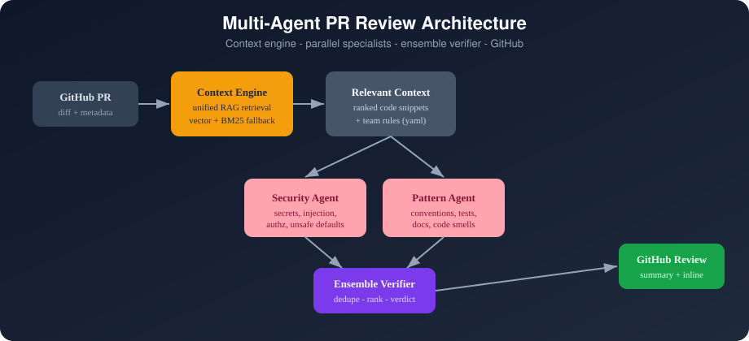
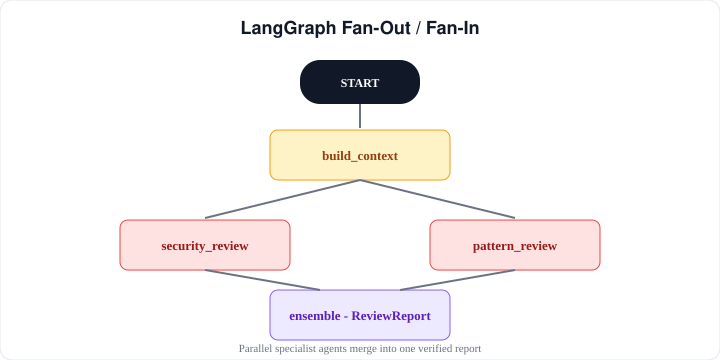
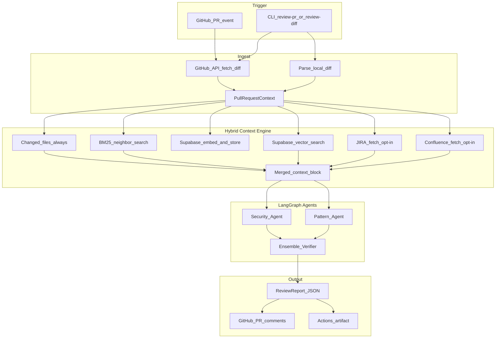
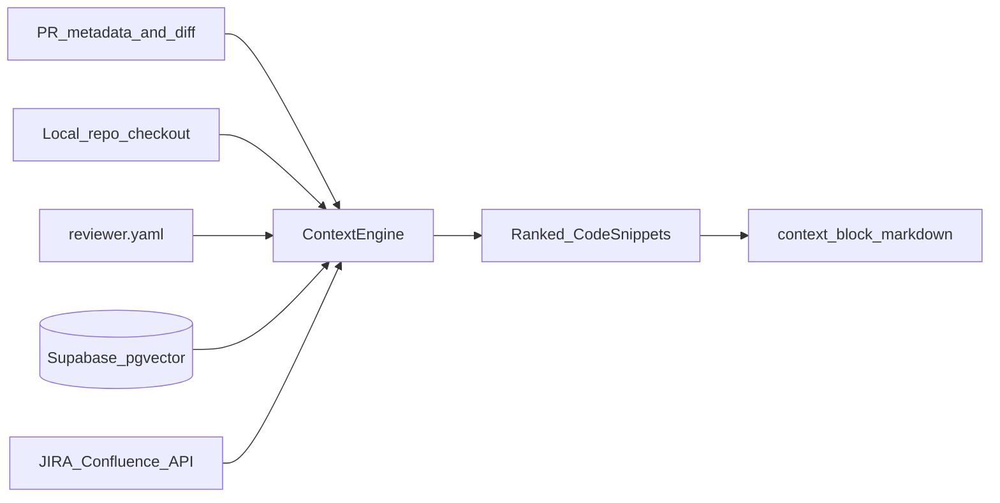
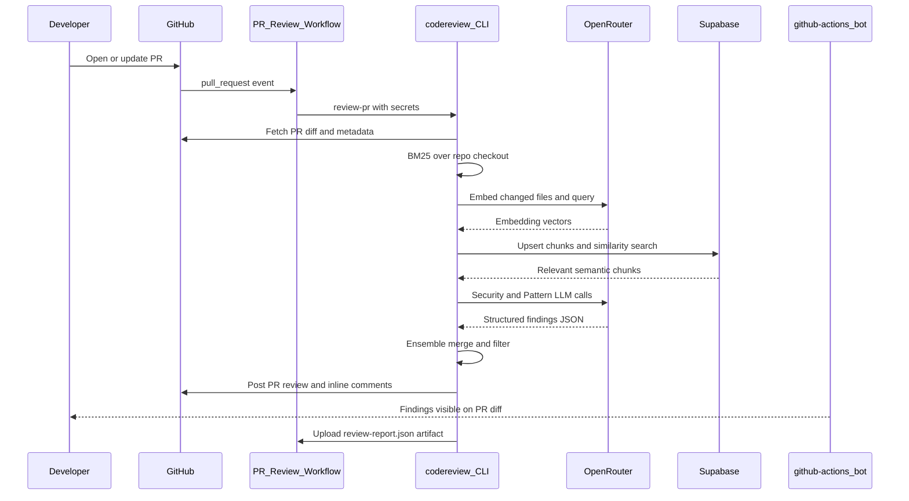

# Multi-Agent GitHub PR Reviewer

Production-style PR review pipeline for GitHub: retrieve relevant repo context, run parallel security and pattern agents, ensemble the findings, and post structured review comments.

<p align="center">
  
</p>

## How it works (summary)

<p align="center">
  
</p>

1. **Trigger** — PR opened/updated or `codereview review-pr` from CLI
2. **Ingest** — fetch changed files and unified diff from GitHub
3. **Retrieve** — hybrid context (BM25 + optional Supabase vectors + optional JIRA/Confluence)
4. **Analyze** — Security + Pattern agents run in parallel (LangGraph)
5. **Ensemble** — dedupe, filter by confidence/severity, assign verdict
6. **Publish** — structured PR review + inline comments + `review-report.json`

<p align="center">
  
</p>

---

## Data flow (detailed)

### End-to-end pipeline



### Step 1 — Trigger

| Path | When |
|---|---|
| **GitHub Action** | `pull_request` opened, synchronized, or reopened |
| **CLI** | `codereview review-pr owner/repo#123` or `codereview review-diff file.patch` |

### Step 2 — Ingest → `PullRequestContext`

The pipeline normalizes all inputs into one object:

| Field | Purpose |
|---|---|
| `changed_files[]` | Files touched in the PR |
| `patches{}` | Unified diff hunks per file |
| `title`, `body` | PR metadata for query terms and JIRA key extraction |
| `head_ref`, `base_ref` | Branch names (ticket keys often appear here) |
| `head_sha` | Commit identity for idempotent GitHub review posting |

### Step 3 — Hybrid context engine

`ContextEngine.build_context()` merges up to **five sources**, ranks them by score, and returns the top N snippets (`context.max_snippets`, default 12).



#### A. Changed files (always on)

Every file in the PR diff is included with a high fixed score. This guarantees the agents always see what actually changed.

#### B. BM25-lite neighbors (always on)

- Loads sibling files in the same directory as changed files
- Scores neighbors by keyword overlap with PR title, body, and diff tokens
- Zero external infrastructure; works offline

#### C. Supabase pgvector (optional)

When `vector.enabled: true` and Supabase credentials are set:

1. Changed/neighbor file content is **chunked** (`max_chunk_chars`, `chunk_overlap`)
2. Chunks are **embedded** via OpenRouter/OpenAI (`text-embedding-3-small`, 1536 dims)
3. Embeddings are **upserted** into Supabase `code_embeddings` keyed by `owner/repo`
4. The PR query is embedded and passed to `match_code_embeddings()` RPC
5. Top-K similar chunks are merged into context with reason `supabase_vector_match`

**Fail-open:** if Supabase or embeddings fail, the review continues with BM25 only.

**Production project (example):** `codereviewer-agent` → `https://uhztjhipngfinpkkvywh.supabase.co`

#### D. JIRA (optional, fail-open)

When `external_context.enabled: true`:

- Parses ticket keys like `CP-123` from PR title, body, and branch names
- Optionally filters by `jira.projects`
- Fetches summary, description, and acceptance-criteria fields via Atlassian REST API
- Appended as snippets like `jira:CP-123`

#### E. Confluence (optional, fail-open)

- Parses Confluence URLs from the PR body
- Optionally follows JIRA remote links when `follow_jira_remote_links: true`
- Appended as snippets like `confluence:123456`

**BAU guarantee:** with `external_context.enabled: false` (the default), steps D and E are skipped entirely. Missing credentials or API errors never fail the workflow.

### Step 4 — LangGraph agent orchestration

```text
START → build_context
           ├→ security_review  ─┐
           └→ pattern_review   ─┴→ ensemble → ReviewReport → END
```

Both specialist agents receive the same inputs:

- PR diffs (`PullRequestContext.patches`)
- `context_block` (merged snippets from step 3)
- `reviewer.yaml` (team rules, severity thresholds, custom regex rules)
- Optional LLM client (OpenRouter / OpenAI / Anthropic)

| Agent | Focus | Layers |
|---|---|---|
| **Security** | Secrets, injection, authz, unsafe defaults | Heuristics always; LLM if `LLM_API_KEY` set |
| **Pattern** | Conventions, TODOs, tests, docs, smells | Heuristics always; LLM if `LLM_API_KEY` set |
| **Ensemble** | Dedupe, filter, verdict | Rules-based; no extra LLM call |

**LLM fail-open:** if the LLM call fails, heuristic findings are still returned.

### Step 5 — Structured output

Each finding is a typed object (not free-form prose):

| Field | Example |
|---|---|
| `category` | `security` |
| `severity` | `high` |
| `title` | `Possible hardcoded secret` |
| `file` / `line` | `src/app/auth.ts:42` |
| `rationale` | Why this matters |
| `suggestion` | What to do instead |
| `confidence` | `0.85` |
| `agent` | `security` |

**Ensemble verdict:**

| Verdict | When |
|---|---|
| `request_changes` | Any high or critical finding survives filtering |
| `comment` | Medium/low findings only |
| `approve` | No findings above threshold |

**Outputs:**

- GitHub PR review (summary + inline comments on changed lines)
- `review-report.json` (audit artifact with latency, token usage, estimated cost)
- GitHub Actions artifact (`review-report`)

### GitHub Action sequence



### What is always on vs optional

| Component | Default | If unavailable |
|---|---|---|
| BM25 + changed files | Always | N/A |
| Supabase vectors | Off (enable in `reviewer.yaml`) | Falls back to BM25 |
| LLM agents | On when `LLM_API_KEY` set | Heuristics only |
| JIRA / Confluence | Off | Skipped |
| GitHub posting | On in Action (`dry_run: false`) | Report still generated locally |

### Core object flow

```text
PullRequestContext
  → ContextEngine → list[CodeSnippet] → context_block (markdown)
  → SecurityAgent  → list[Finding]
  → PatternAgent   → list[Finding]
  → EnsembleAgent  → ReviewReport
  → GitHubClient   → PR review + inline comments
```

---

## Example output on GitHub

<p align="center">
  
</p>

## Features

- Structured findings: category, severity, file, line, rationale, suggestion, confidence
- Hybrid context retrieval: BM25-lite + optional **Supabase pgvector** semantic search
- Optional **JIRA / Confluence** context (fail-open, disabled by default — BAU unchanged)
- Benchmark eval suite with precision/recall on golden labeled PR diffs
- Parallel specialist agents with LangGraph fan-out/fan-in
- Ensemble verifier dedupes, filters, and assigns verdict
- Works offline with `review-diff` (no GitHub API)
- GitHub Action for company repos
- Team rules via `reviewer.yaml` (procedural memory)
- OpenRouter, OpenAI, or Anthropic for LLM-backed analysis

## Quick start

### 1. Install

```bash
python -m venv .venv
source .venv/bin/activate
pip install -e ".[dev]"
```

### 2. Configure

Copy the example config into your target repo:

```bash
cp reviewer.example.yaml reviewer.yaml
```

Set environment variables:

```bash
export LLM_API_KEY=sk-or-...          # OpenRouter API key
export LLM_PROVIDER=openrouter        # openrouter | openai | anthropic
export LLM_MODEL=openai/gpt-4o-mini   # optional; any OpenRouter model slug
export GITHUB_TOKEN=ghp_...           # only needed for review-pr
```

Copy [`.env.example`](.env.example) to `.env` for local development.

**OpenRouter (recommended):** use your OpenRouter key as `LLM_API_KEY` with `LLM_PROVIDER=openrouter`. Pick any model from [openrouter.ai/models](https://openrouter.ai/models), e.g. `openai/gpt-4o-mini`, `anthropic/claude-3.5-sonnet`.

### 3. Review a local diff (no API keys required for heuristics)

```bash
codereview review-diff tests/fixtures/sample_diff.patch --repo-root .
```

### 4. Review a GitHub PR

```bash
codereview review-pr owner/repo#123 --repo-root . --output review-report.json
```

Use `--dry-run` to generate the report without posting comments.

## Hybrid context (BM25 + Supabase vectors)

By default, context retrieval uses **BM25-lite** over changed files and neighbors (zero infra).

Enable semantic retrieval with **Supabase pgvector** (free tier works):

1. Create a [Supabase](https://supabase.com) project (or use the CLI: `supabase projects create`)
2. Link and push migrations:

```bash
supabase link --project-ref <your-project-ref>
supabase db push
```

Or run [`supabase/migrations/001_code_embeddings.sql`](supabase/migrations/001_code_embeddings.sql) manually in the SQL editor.

3. Set secrets / env vars:

```bash
export SUPABASE_URL=https://xxxx.supabase.co
export SUPABASE_SERVICE_ROLE_KEY=eyJ...
```

4. Enable in `reviewer.yaml`:

```yaml
vector:
  enabled: true
  embedding_model: openai/text-embedding-3-small
  supabase:
    enabled: true
    index_on_review: true
    match_threshold: 0.55
    vector_top_k: 8
```

On each review, changed files are embedded and stored; similar chunks are retrieved for the PR query. Over time this builds a **per-repo semantic memory** in Supabase. If Supabase is unavailable, the agent **falls back to BM25** automatically.

### Supabase schema

| Object | Role |
|---|---|
| `code_embeddings` table | Stores chunked file content + 1536-dim vectors per `owner/repo` |
| `match_code_embeddings()` | RPC for cosine-similarity search filtered by repo |

## JIRA / Confluence context (opt-in, fail-open)

Disabled by default — existing workflows keep working.

```yaml
external_context:
  enabled: true
  jira:
    enabled: true
    base_url: yourcompany.atlassian.net
    projects: [CP]
  confluence:
    enabled: true
```

PR convention:

```markdown
## JIRA
[CP-123] Add session export

## Confluence
https://yourcompany.atlassian.net/wiki/spaces/ENG/pages/123456/Design
```

Secrets (GitHub Actions or local):

```bash
export ATLASSIAN_EMAIL=you@company.com
export ATLASSIAN_API_TOKEN=...
export ATLASSIAN_DOMAIN=yourcompany.atlassian.net
```

If credentials are missing or JIRA is down, the review **continues with repo-only context**.

## Benchmark evaluation

Measure precision/recall on labeled golden diffs:

```bash
codereview eval --benchmark-dir benchmarks/golden --output benchmarks/results.json
```

Use this to tune `severity_threshold`, compare OpenRouter models, and catch regressions when changing prompts or agents. See [`benchmarks/README.md`](benchmarks/README.md) to add more cases (target 20+ real PRs over time).

## GitHub Action (company install)

Add to your company repo:

```yaml
# .github/workflows/pr-review.yml
name: PR Review
on:
  pull_request:
    types: [opened, synchronize, reopened]

permissions:
  contents: read
  pull-requests: write

jobs:
  review:
    runs-on: ubuntu-latest
    steps:
      - uses: actions/checkout@v4
        with:
          fetch-depth: 0

      - uses: cipheraxat/codereviewer_agent/action@main
        with:
          llm_api_key: ${{ secrets.LLM_API_KEY }}
          llm_provider: openrouter
          llm_model: openai/gpt-4o-mini
          config_path: reviewer.yaml
          dry_run: "false"
```

The action reads these **optional** repository secrets when present:

| Secret | Purpose |
|---|---|
| `LLM_API_KEY` | OpenRouter/OpenAI/Anthropic (review + embeddings) |
| `SUPABASE_URL` | Supabase project URL for vector context |
| `SUPABASE_SERVICE_ROLE_KEY` | Supabase service role for embedding upsert/search |
| `ATLASSIAN_EMAIL` | JIRA/Confluence API user (optional) |
| `ATLASSIAN_API_TOKEN` | Atlassian API token (optional) |
| `ATLASSIAN_DOMAIN` | e.g. `yourcompany.atlassian.net` (optional) |

Reviews post as **github-actions[bot]** using the default `GITHUB_TOKEN`.

### Company setup checklist

1. Add `reviewer.yaml` with your team's ignore paths and custom rules
2. Create repo secret `LLM_API_KEY` (your OpenRouter API key)
3. Optionally add `SUPABASE_URL` and `SUPABASE_SERVICE_ROLE_KEY` for semantic RAG
4. Enable the workflow on `pull_request`
5. Start with `dry_run: true` for one sprint, then switch to live posting
6. Tune `severity_threshold` and `posting.min_confidence` to reduce noise
7. Run `codereview eval` periodically to track precision/recall

### Live example

This project powers PR reviews on [CopilotPulse](https://github.com/cipheraxat/CopilotPulse) with Supabase vectors enabled.

## CLI

```bash
codereview review-pr owner/repo#123 [--no-post] [--dry-run] [--config reviewer.yaml]
codereview review-diff path/to/changes.patch [--title "My change"]
codereview eval [--benchmark-dir benchmarks/golden] [--output benchmarks/results.json]
codereview version
```

## Output

- Terminal summary table
- `review-report.json` audit artifact with metrics (latency, token usage, estimated cost)

## Project layout

```text
src/codereview/
  cli.py                 # review-pr, review-diff, eval
  github_client.py       # PR fetch + review posting
  context_engine.py    # hybrid BM25 + Supabase + external context
  external_context.py  # JIRA / Confluence fetchers (fail-open)
  embeddings.py          # OpenRouter/OpenAI embedding client
  vector_store.py      # Supabase pgvector upsert + search
  eval.py                # precision/recall benchmark runner
  graph.py               # LangGraph orchestrator
  agents/
    security.py
    pattern.py
    ensemble.py
supabase/migrations/
  001_code_embeddings.sql
benchmarks/golden/       # labeled PR diffs for eval
action/
  action.yml
docs/images/
  architecture.svg
  data-flow.svg
  langgraph-pipeline.svg
  github-review-example.svg
```

## Resume bullet

Built a multi-agent GitHub PR reviewer (LangGraph) with hybrid RAG (BM25 + Supabase pgvector), optional JIRA context, parallel security/pattern agents, ensemble verification, and precision/recall eval — posting structured inline comments via GitHub Actions.

## Roadmap (v2)

- Webhook ingress service (FastAPI + Redis queue)
- Episodic review memory across PRs (review history in Supabase)
- TimescaleDB observability for cost/latency trends

## License

MIT
